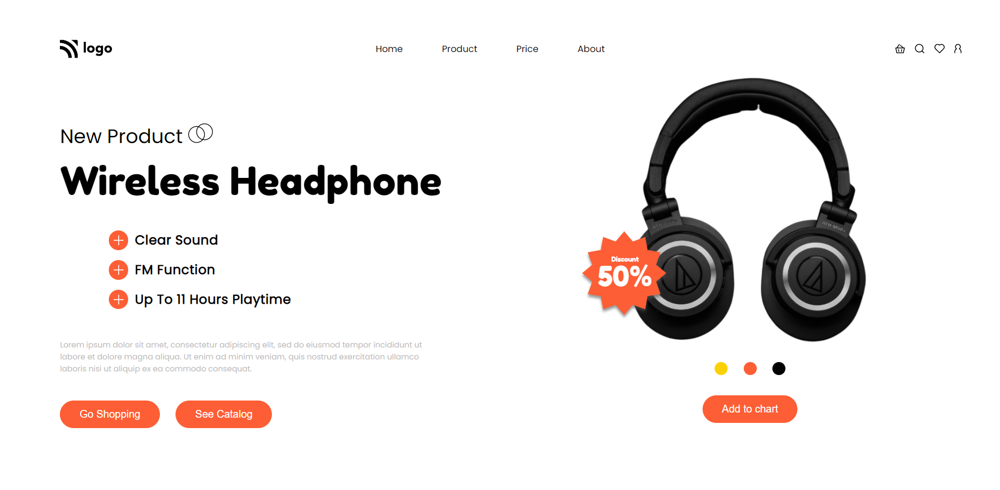

# Product Home Page

## :link: [See it live](https://fullstack-js-bc-project-07.netlify.app/)

## :clipboard: Learning Outcomes 

- Use of CSS3 `filter` property to add `drop-shadow` to image
- Use of the combination of `position: relative` and `position: absolute` properties

## :camera: Screenshot

